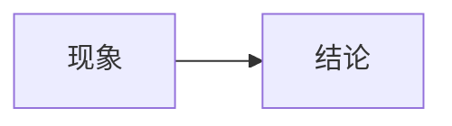

# details 测试



## 这是一个二级标题

这是一个段落，包含**粗体**和*斜体*文本。

- 列表项 1
- 列表项 2
- 列表项 3





你好呀

这个页面用于测试details标签

**details 测试完毕**

# Code标签测试

```cpp
#include <stdio.h>

using namespace std;

int main(){

    printf("你好!\n");
    cout<<"Hello!"<<endl;
    return 0;
}
```

这个程序混合了`cpp`与`c`的语法。

# Latex 测试

$$
这是块级公式\\
f(x)=2x-1\\
g(x)=\frac{2-f(x)}{3}\\
h(x) \le a\\
$$
那么$I(x)=\frac{U}{R}*\dot{x}$就是行内公式。

# mermaid 测试




<div class="mermaid">
graph LR
现象-->结论
</div>
